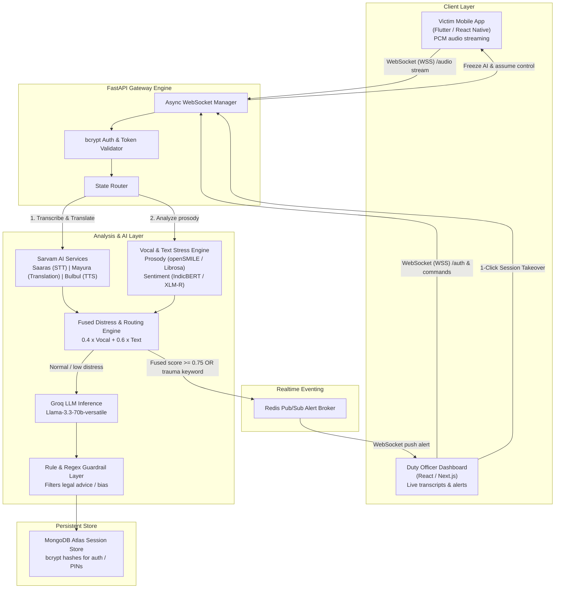
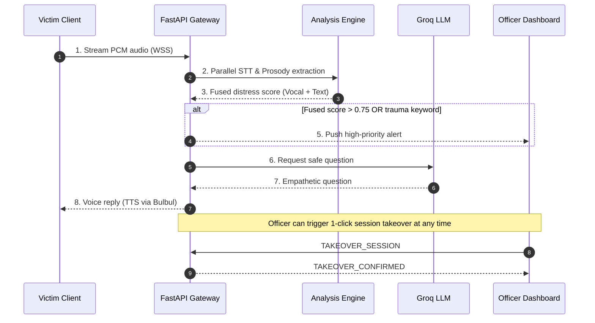

# Product Requirements Document (PRD)

## AI-Based Real-Time Stress & Trauma Assessment Platform

| Field | Detail |
|---|---|
| **Problem Statement ID** | SIH26093 |
| **Organization** | Ministry of Social Justice and Empowerment (MoSJE) / Ministry of Home Affairs (MHA) |
| **Category** | Software — Smart Automation / Healthcare |
| **Document Owner** | Development Team |
| **Version** | 2.2 (FastAPI Native Pipeline + bcrypt Cryptographic Security + Team Roles & Work Allocation) |
| **Date** | September 2026 |

---

## 1. Executive Summary

This Product Requirements Document defines the system requirements, architecture, and functional specifications for an AI-powered trauma-informed intake platform. Built for crime victims, elderly individuals, or distressed complainants approaching authorities (e.g., at police desks, One Stop Centres/Sakhi, or child welfare committees), the platform facilitates safe, voice-first communication.

The system utilizes an asynchronous FastAPI gateway, Sarvam AI for Indian-language speech/translation, Groq for low-latency LLM inference, an independent Vocal & Text Stress Fusion Engine, and bcrypt for secure user authentication and sensitive record verification. Instead of forcing users through rigid forms, the system maintains an empathetic, adaptive dialogue while continually evaluating distress metrics. If acute distress, trauma, or emergency keywords (e.g., assault, threat) are detected, the system dispatches an instant alert to a higher authority/duty officer web dashboard for real-time monitoring and one-click session takeover.

---

## 2. Team Structure & Module Work Allocation

| Member / Role | Work Allocation & Ownership Area | Core Deliverables & Technologies |
|---|---|---|
| **Team Lead & System Architect** | Overall architecture design, FastAPI gateway routing, state routing, and deployment pipeline. | FastAPI WebSocket manager, system orchestration, Docker containerization, Azure cloud deployment, Redis Pub/Sub architecture. |
| **Backend & Security Engineer** | Database architecture, authentication services, cryptographic security, and regulatory compliance. | MongoDB Atlas schemas, bcrypt password/PIN hashing pipelines, JWT token authentication, DPDP Act 2023 field encryption, and audit log generation. |
| **AI/ML & NLP Pipeline Engineer** | Speech-to-text, neural translation, acoustic analysis, and distress score fusion algorithms. | Sarvam AI (Saaras, Mayura, Bulbul) integration, Groq LLM prompt design & guardrails, openSMILE/Librosa vocal prosody extraction, and multi-modal distress scoring. |
| **Frontend & UI/UX Engineer** | Cross-platform victim intake client and real-time supervisory web dashboard. | Flutter/React Native mobile app (PCM audio streaming, native UI), React/Next.js Duty Officer Dashboard (live transcripts, real-time alert popups, 1-click takeover). |

---

## 3. Problem Statement & User Pain Points

Victims of abuse, assault, trafficking, or domestic violence frequently face:

- **Secondary Victimization:** Being forced to retell painful stories repeatedly to multiple officials.
- **Insensitive Questioning:** Standard chronological forms that heighten psychological distress.
- **Language Barriers:** Inability to communicate comfortably in official administrative languages.
- **Unnoticed Distress:** Absence of real-time monitoring to detect dissociation, panic, or acute stress during intake.
- **Delayed Emergency Response:** No automated system to flag high-risk cases directly to supervisory authorities in real time.
- **Credential & Session Security Risks:** Insecure handling of duty officer credentials and confidential victim session access.

---

## 4. Objectives & Key Metrics

| Objective | Target Metric |
|---|---|
| Low-Latency Dialogue | Total voice turn-taking loop < 1.5 seconds |
| Real-time Distress Alerting | Escalation alert dispatched to officer dashboard within 2 seconds of detection |
| Multilingual Support | End-to-end voice support for English, Hindi, and regional Indian languages via Sarvam AI |
| Human-in-the-Loop Safety | 100% officer review/sign-off required; 0% autonomous final legal decisions |
| Data & Auth Security | Passwords hashed using bcrypt (work factor >= 12); full DPDP Act 2023 compliance |

---

## 5. User Personas & Cryptographic Access

- **Victim / Complainant (Mobile App User):** Needs a low-stress, voice-first interface in their native language. Access is granted via anonymous, short-lived session tokens or PINs hashed via bcrypt.
- **Duty Officer / Counsellor (Dashboard User):** Authenticates securely using bcrypt-hashed credentials. Receives real-time alerts, monitors live session transcripts and distress levels, and takes over sessions.
- **Higher Authority / Supervisor:** Authenticates via bcrypt-secured multi-factor authentication. Audits session summaries, tracks regional distress metrics, and verifies officer sign-offs.

---

## 6. System Architecture & Component Interactions

The system uses a decoupled, real-time streaming pipeline:



> **Legend:** PCM voice travels from the mobile client into the gateway; text and vocal signals are fused into a distress score; normal flows generate trauma-informed responses via Groq, while high-risk flows trigger immediate officer alerts via Redis Pub/Sub. Authenticated officers can take over any session with one click.

---

## 7. Detailed Data Model & Schemas (MongoDB)

### Collection: `users` (Duty Officers & Admins)

```json
{
  "_id": { "$oid": "66dff012a4b3f8112a9e1000" },
  "user_id": "off_mha_8831",
  "username": "officer_sharma",
  "email": "r.sharma@mha.gov.in",
  "password_hash": "$2b$12$e8N8Gv2u7qWfL4u0vA5a.O3mK.j2wY4A5e8N8Gv2u7qWfL4u0vA5a",
  "role": "DUTY_OFFICER",
  "station_code": "DEL-SZ-04",
  "created_at": { "$date": "2026-09-07T20:00:00.000Z" }
}
```

### Collection: `sessions`

```json
{
  "_id": { "$oid": "66dff012a4b3f8112a9e1001" },
  "session_id": "sess_99381024",
  "victim_user_id": "usr_anon_4412",
  "access_pin_hash": "$2b$12$K3v2...hashed_victim_pin",
  "language": "hi-IN",
  "consent": {
    "given": true,
    "timestamp": { "$date": "2026-09-07T20:45:00.000Z" },
    "mode": "voice"
  },
  "status": "ACTIVE_INTAKE",
  "current_distress_level": "critical",
  "fused_score": 0.82,
  "assigned_authority": {
    "officer_id": "off_mha_8831",
    "station_code": "DEL-SZ-04"
  },
  "created_at": { "$date": "2026-09-07T20:45:00.000Z" },
  "updated_at": { "$date": "2026-09-07T20:48:12.000Z" }
}
```

### Collection: `transcripts`

```json
{
  "_id": { "$oid": "66dff012a4b3f8112a9e1002" },
  "session_id": "sess_99381024",
  "turns": [
    {
      "turn_id": 1,
      "speaker": "agent",
      "text": "Hello, you are in a safe space. Can you tell me what happened?",
      "timestamp": { "$date": "2026-09-07T20:45:05.000Z" }
    },
    {
      "turn_id": 2,
      "speaker": "victim",
      "raw_text_native": "मुझे मदद चाहिए, किसी ने मुझ पर हमला किया है।",
      "translated_text_en": "I need help, someone assaulted me.",
      "metrics": {
        "text_sentiment_fear": 0.88,
        "vocal_stress_score": 0.85,
        "fused_distress_score": 0.86
      },
      "timestamp": { "$date": "2026-09-07T20:45:22.000Z" }
    }
  ]
}
```

### Collection: `alerts`

```json
{
  "_id": { "$oid": "66dff012a4b3f8112a9e1003" },
  "session_id": "sess_99381024",
  "alert_type": "CRITICAL_DISTRESS_EXCEEDED",
  "trigger_reason": "High distress score (0.86) + Assault keyword detected",
  "status": "DISPATCHED",
  "dispatched_at": { "$date": "2026-09-07T20:45:23.000Z" },
  "acknowledged_by": "off_mha_8831",
  "acknowledged_at": { "$date": "2026-09-07T20:45:28.000Z" }
}
```

---

## 8. Operational Workflow & Execution Logic



### Step-by-Step Execution

1. **Authentication:** Duty officers log in via `/api/v1/auth/login`. Plaintext passwords are validated against stored bcrypt hashes using `passlib.context.CryptContext(schemes=["bcrypt"])`.

2. **Voice Ingestion:** The victim streams PCM audio chunks over WebSockets to the FastAPI gateway.

3. **Parallel Speech & Prosody Extraction:** Audio is routed simultaneously to Sarvam AI for transcription/translation and the Vocal Stress Engine for acoustic analysis.

4. **Multi-Modal Distress Fusion:** Text affect and vocal prosody are combined into a single score:

$$\text{Fused Score} = (0.4 \times \text{Vocal Stress}) + (0.6 \times \text{Text Fear/Trauma Score})$$

5. **Authority Escalation Trigger:** If the score exceeds 0.75 or trauma keywords (e.g., assault, weapon, forced) are identified, a Redis Pub/Sub event immediately pushes a critical alert to duty officers via WebSockets.

6. **Adaptive Dialogue:** Groq generates the next trauma-informed question, which passes through regex/rule guardrails before being spoken back via Sarvam Bulbul TTS.

7. **Officer Takeover:** Authenticated duty officers can click "Take Over Session" on their dashboard at any time to freeze AI generation and assume direct control over the conversation.

---

## 9. Technical Implementation (Backend Gateway with bcrypt)

```python
import asyncio
import json
import os
from fastapi import FastAPI, WebSocket, WebSocketDisconnect, Depends, HTTPException, status
from fastapi.middleware.cors import CORSMiddleware
from fastapi.security import OAuth2PasswordBearer, OAuth2PasswordRequestForm
from pydantic import BaseModel
from passlib.context import CryptContext
from groq import AsyncGroq
import motor.motor_asyncio
import redis.asyncio as redis

MONGO_URI = os.getenv("MONGO_URI", "mongodb://localhost:27017")
REDIS_URI = os.getenv("REDIS_URI", "redis://localhost:6379")
GROQ_API_KEY = os.getenv("GROQ_API_KEY", "mock_groq_key")

app = FastAPI(title="SIH26093 Trauma Assessment Platform")

app.add_middleware(
    CORSMiddleware,
    allow_origins=["*"],
    allow_credentials=True,
    allow_methods=["*"],
    allow_headers=["*"],
)

# Cryptographic Context using bcrypt
pwd_context = CryptContext(schemes=["bcrypt"], deprecated="auto")

def hash_password(password: str) -> str:
    return pwd_context.hash(password)

def verify_password(plain_password: str, hashed_password: str) -> bool:
    return pwd_context.verify(plain_password, hashed_password)

mongo_client = motor.motor_asyncio.AsyncIOMotorClient(MONGO_URI)
db = mongo_client["trauma_db"]
redis_client = redis.from_url(REDIS_URI, decode_responses=True)
groq_client = AsyncGroq(api_key=GROQ_API_KEY)

class ConnectionManager:
    def __init__(self):
        self.active_mobile_connections: dict[str, WebSocket] = {}
        self.active_authority_connections: dict[str, WebSocket] = {}

    async def connect_mobile(self, session_id: str, websocket: WebSocket):
        await websocket.accept()
        self.active_mobile_connections[session_id] = websocket

    async def connect_authority(self, authority_id: str, websocket: WebSocket):
        await websocket.accept()
        self.active_authority_connections[authority_id] = websocket

    def disconnect_mobile(self, session_id: str):
        self.active_mobile_connections.pop(session_id, None)

    def disconnect_authority(self, authority_id: str):
        self.active_authority_connections.pop(authority_id, None)

    async def notify_authorities(self, alert_data: dict):
        message = json.dumps(alert_data)
        for ws in self.active_authority_connections.values():
            await ws.send_text(message)

manager = ConnectionManager()

# Auth Models and Endpoints using bcrypt
class UserRegisterRequest(BaseModel):
    username: str
    password: str
    email: str
    role: str = "DUTY_OFFICER"
    station_code: str

@app.post("/api/v1/auth/register")
async def register_officer(req: UserRegisterRequest):
    existing = await db["users"].find_one({"username": req.username})
    if existing:
        raise HTTPException(status_code=400, detail="Username already exists")

    hashed_pwd = hash_password(req.password)
    user_doc = {
        "username": req.username,
        "password_hash": hashed_pwd,
        "email": req.email,
        "role": req.role,
        "station_code": req.station_code,
        "created_at": asyncio.get_event_loop().time()
    }
    await db["users"].insert_one(user_doc)
    return {"message": "Officer registered successfully", "username": req.username}

@app.post("/api/v1/auth/login")
async def login_officer(form_data: OAuth2PasswordRequestForm = Depends()):
    user = await db["users"].find_one({"username": form_data.username})
    if not user or not verify_password(form_data.password, user["password_hash"]):
        raise HTTPException(
            status_code=status.HTTP_401_UNAUTHORIZED,
            detail="Incorrect username or password"
        )
    return {
        "access_token": f"mock_token_for_{user['username']}",
        "token_type": "bearer",
        "role": user["role"],
        "station_code": user["station_code"]
    }

# Mock Speech & Analysis Services
async def mock_sarvam_stt_and_translation(audio_bytes: bytes) -> tuple[str, str]:
    await asyncio.sleep(0.05)
    return "मुझे मदद चाहिए, किसी ने मुझ पर हमला किया है।", "I need help, someone assaulted me."

async def analyze_vocal_and_text_stress(audio_bytes: bytes, text: str) -> dict:
    keywords = ["assault", "forced", "hit", "weapon", "attack", "rape", "abuse"]
    has_keyword = any(kw in text.lower() for kw in keywords)
    vocal_stress = 0.82
    text_fear = 0.88 if has_keyword else 0.30
    fused_score = round((vocal_stress * 0.4) + (text_fear * 0.6), 2)
    return {
        "vocal_stress": vocal_stress,
        "text_sentiment_fear": text_fear,
        "fused_score": fused_score,
        "emergency_keyword_detected": has_keyword
    }

async def generate_trauma_response(prompt_text: str) -> str:
    system_prompt = (
        "You are a trauma-informed initial intake assistant for crime victims. "
        "Rules: Speak calmly, ask one short open question at a time. "
        "Never offer legal advice or ask for graphic details."
    )
    try:
        response = await groq_client.chat.completions.create(
            model="llama-3.3-70b-versatile",
            messages=[
                {"role": "system", "content": system_prompt},
                {"role": "user", "content": prompt_text}
            ],
            temperature=0.2,
            max_tokens=100
        )
        return response.choices[0].message.content
    except Exception:
        return "I hear you. You are in a safe space. Can you tell me if you are in a safe location right now?"

@app.websocket("/ws/v1/session/{session_id}/stream")
async def mobile_session_websocket(websocket: WebSocket, session_id: str):
    await manager.connect_mobile(session_id, websocket)
    try:
        while True:
            data = await websocket.receive_bytes()
            native_text, translated_text = await mock_sarvam_stt_and_translation(data)
            metrics = await analyze_vocal_and_text_stress(data, translated_text)
            fused_score = metrics["fused_score"]

            distress_level = "critical" if fused_score >= 0.75 else "medium" if fused_score >= 0.45 else "low"
            await db["sessions"].update_one(
                {"session_id": session_id},
                {"$set": {"fused_score": fused_score, "current_distress_level": distress_level}}
            )

            if fused_score >= 0.75 or metrics["emergency_keyword_detected"]:
                alert_payload = {
                    "event": "CRITICAL_DISTRESS_ALERT",
                    "session_id": session_id,
                    "fused_score": fused_score,
                    "distress_level": distress_level,
                    "snippet": native_text,
                    "timestamp": asyncio.get_event_loop().time()
                }
                await manager.notify_authorities(alert_payload)
                await db["alerts"].insert_one(alert_payload)

            agent_reply = await generate_trauma_response(translated_text)
            response_payload = {
                "turn_complete": True,
                "recognized_text": native_text,
                "agent_reply_text": agent_reply,
                "distress_metrics": metrics
            }
            await websocket.send_text(json.dumps(response_payload))
    except WebSocketDisconnect:
        manager.disconnect_mobile(session_id)

@app.websocket("/ws/v1/authority/dashboard/{authority_id}")
async def authority_dashboard_websocket(websocket: WebSocket, authority_id: str):
    await manager.connect_authority(authority_id, websocket)
    try:
        while True:
            text_data = await websocket.receive_text()
            payload = json.loads(text_data)
            if payload.get("action") == "TAKEOVER_SESSION":
                target_session_id = payload.get("session_id")
                await db["sessions"].update_one(
                    {"session_id": target_session_id},
                    {"$set": {"status": "HUMAN_TAKEOVER", "assigned_officer_id": authority_id}}
                )
                await websocket.send_text(json.dumps({
                    "event": "TAKEOVER_CONFIRMED",
                    "session_id": target_session_id
                }))
    except WebSocketDisconnect:
        manager.disconnect_authority(authority_id)
```

---

## 10. Non-Functional & Compliance Requirements

- **Cryptographic Hashing (bcrypt):** All officer credentials, administrative passwords, and victim access PINs must be salted and hashed using bcrypt with a minimum cost/work factor of 12. Plaintext passwords must never be logged or stored in persistent storage.
- **Data Protection (DPDP Act 2023):** Explicit voice consent required prior to streaming. Audio buffers are held in memory for processing and purged immediately; no raw audio files are written to persistent disk storage.
- **Security & Access Control:** End-to-end encryption (TLS 1.3/WSS) for all WebSocket streams and REST APIs. Database collections use field-level encryption for sensitive PII.
- **High Availability & Fallback:** If WebSocket streaming drops due to low connectivity, the mobile client falls back to long-polling HTTP text turns without clearing session history.
